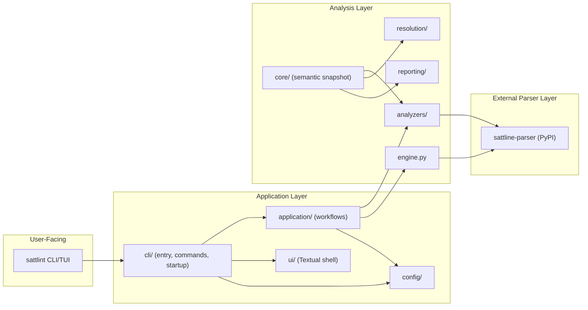
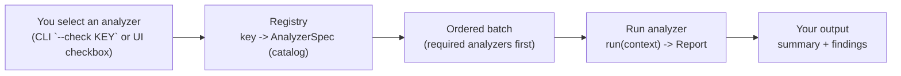
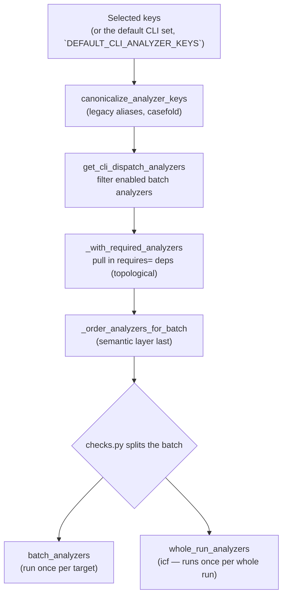
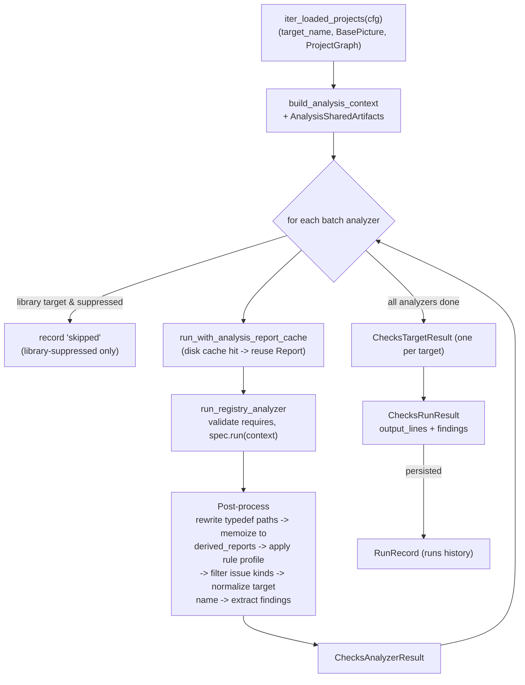
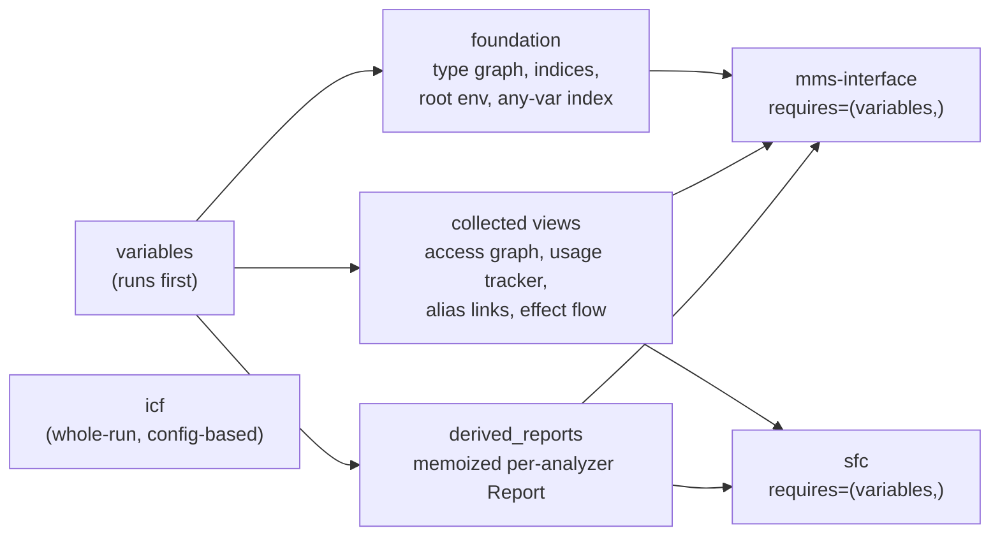

# Architecture Summary

This is the short architecture summary for onboarding and AI routing.
For deeper design rationale, principles, and operating details, use
`AGENTS_REFERENCE.md`.

## Layering

### Layer responsibilities

- `src/sattlint/cli/` owns the CLI entry point (`startup.py`), subcommand dispatch, and interactive-shell startup.
- `src/sattlint/application/` owns terminal-agnostic workflows: menu commands, checks, and project-driven analysis entry points.
- `src/sattlint/ui/` owns the Textual interactive shell (no subcommand).
- `src/sattlint/config/` owns settings loading, defaults, and validation.
- `src/sattlint/core/` owns the semantic snapshot helpers used by analysis.
- `src/sattlint/change_review/` owns the Change Review capability: a semantic diff and
  impact analysis between an official (`.x`) and a draft (`.s`) version of a project,
  producing a compact JSON + Markdown review artifact. It reuses the semantic snapshot
  and is fully independent of static analysis.
- `src/sattlint/analyzers/` owns the heuristic analyzers and the registry.
- `sattline-parser` (external dependency, `sattline-parser>=2026.9.1`) owns the SattLine grammar, parse tree transformation, and AST models.

## Operational Layer

- `src/sattlint/` owns runtime product code. Repository maintenance tooling and generated health dashboards are not shipped.
- `.github/` owns CI workflows and scoped instruction files.

## Actual Runtime Entry Map

- `sattlint` enters at `src/sattlint/cli/startup.py`. With a subcommand it dispatches to the non-interactive handlers in `src/sattlint/cli/commands.py` (`syntax-check`, `analyze`, `validate-config`, `cache-prune`); with no subcommand it starts the interactive Textual shell from `src/sattlint/ui/`.
- The interactive UI (`sattlint` with no arguments) provides Analyze, Setup, and Help views.

## Analyzer Workflow

Analyzers live in `src/sattlint/analyzers/` and are described by `AnalyzerSpec`
(key, name, description, a `run(context) -> Report` callable, `requires` deps, and
semantic mapping metadata). The registry at `src/sattlint/analyzers/registry/__init__.py`
is the single rule catalog; it builds the `AnalyzerCatalog` once, validates the
dependency graph, and orders specs deterministically. The framework primitives
(`AnalysisContext`, `AnalysisSharedArtifacts`, `AnalyzerSpec`, `Report`) live in
`src/sattlint/analyzers/framework/`.

### Mental model — select an analyzer, get its output

Under the hood the "select and run" is two stages: **selection/dispatch**
(resolve the selected keys into an ordered batch) and **per-target execution**
(load each target, run the batch, fold results into one `ChecksRunResult`).

### Stage 1 — Selection and dispatch

Entry: `sattlint analyze` (CLI) or the Textual Analyze view. Both end up at
`run_checks` / `run_checks_result` in `src/sattlint/application/checks.py`.

### Stage 2 — Per-target execution pipeline

For every loaded target, `collect_run_checks_result` builds one `AnalysisContext`
(shared across all analyzers of that target) and then runs the batch in order.
Each analyzer's `Report` is post-processed before it becomes a result.

### Shared artifacts — why `requires=("variables",)` does not re-run

The `variables` analyzer runs once per target and fills `AnalysisSharedArtifacts`
(`src/sattlint/analyzers/framework/_shared_analysis.py`): the **foundation**
(type graph, indices, root env, any-variable index) and the **collected views**
(access graph, usage tracker, alias links, effect flow). Downstream analyzers such
as `mms-interface` and `sfc` declare `requires=("variables",)` and consume those
memoized artifacts instead of re-running the instance traversal. Every analyzer
also memoizes its `Report` into `derived_reports`, so a later consumer can reuse it.

Two special cases worth knowing before changing anything:

- **`sattline-semantics`** is an aggregate layer (not CLI-selectable). It runs every
  *semantic contributor* analyzer (those with `semantic_mapping_kind` / `semantic_rule_source`
  set), maps their issues onto semantic rules, dedupes, and folds them into one
  `SattLineSemanticsReport` — the surface the LSP server uses.
  See `src/sattlint/analyzers/sattline_semantics.py`.
- **`icf`** is a whole-run analyzer: it does not run per target. `checks.py` pulls it
  out of the batch and runs it once over the whole config after all targets are done.

## Critical Boundaries

- Parser core ships as the external `sattline-parser` package and does not depend on application layers.
- All retained analyzers use the same semantic engine and findings model.
- The analyzer registry is the single rule catalog; CLI, UI, and reporting read from it rather than duplicating rule lists.

## Quality Anchors

- Fast local gate: `python -m pre_commit run --all-files` (when configured) or `ruff check`, `pyright`, and focused `pytest`
- Pyright runs `strict` package-wide except `src/sattlint/ui/`, a deliberate carve-out: `ignore` in `pyproject.toml` `[tool.pyright]` suppresses diagnostics there because the Textual shell drives dynamic runtime APIs that are not practical under strict typing. The shell is exercised by the full pytest suite instead of the type checker.
- Full suite: `python -m pytest -q`
- CI: GitHub Actions workflow `ci.yml` runs ruff, pyright, and the full pytest suite plus wheel smokes on pull request and push to `main`.
