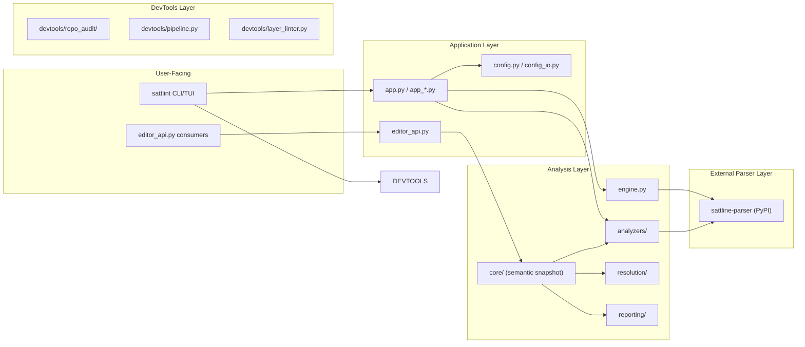

# Architecture Summary

This is the short architecture summary for onboarding and AI routing.
For deeper design rationale, use `docs/design-docs/`.

## Layering

### Layer responsibilities

- `src/sattlint/editor_api.py` is the public editor-facing compatibility facade.
- `src/sattlint/core/` owns the semantic helpers behind that facade.
- `src/sattlint/` owns CLI flows, analyzers, reporting, and configuration.
- `sattline-parser` (external dependency) owns the SattLine grammar, parse tree transformation, and AST models.

## Operational Layer

- `src/sattlint/devtools/` owns repo audit, pipeline checks, layer lint, reporting, and health artifacts.
- `.github/` owns instructions and GitHub workflows.
- `metrics/` owns maintainer operating thresholds and curated health history snapshots.

## Actual Runtime Entry Map

- `sattlint` enters at `src/sattlint/app.py`. Stable command-mode flows and the preview menu both start there, then fan into app helpers, analyzers, reporting, and parser-backed semantic loading.
- External editor integrations should enter through `src/sattlint/editor_api.py`; that module intentionally forwards into `src/sattlint/core/semantic.py` so compatibility consumers share one semantic pipeline.
- `sattlint-repo-audit` and `sattlint-layer-lint` enter through `src/sattlint/devtools/`. They are repository tooling surfaces, not part of the parser or editor runtime loop.

## Critical Boundaries

- Parser core ships as the external `sattline-parser` package and does not depend on application or editor layers.
- Editor-facing code degrades only through documented workspace or dirty-buffer paths, and `src/sattlint/editor_api.py` remains a compatibility boundary rather than a second semantic core.
- Devtools report through machine-readable JSON artifacts rather than ad hoc text.
- Global assistant guidance stays thin; scoped rules live in `.github/instructions/`.

## Quality Anchors

- Fast local gate: `python -m pre_commit run --all-files`
- Pre-push gate: `sattlint-repo-audit --profile full --check-my-changes --output-dir artifacts/audit`
- Context health gate: `python scripts/context_health.py --check`
- Repo health gate: `python scripts/repo_health.py --check --audit-dir artifacts/audit`

## Why This Split Works

- Runtime code remains separate from repo operations and policy checks.
- Assistant routing stays explicit through repo maps, scoped instructions, and focused validation.
- Health reporting stays deterministic because it reads the same audit artifacts that CI and humans already inspect.
