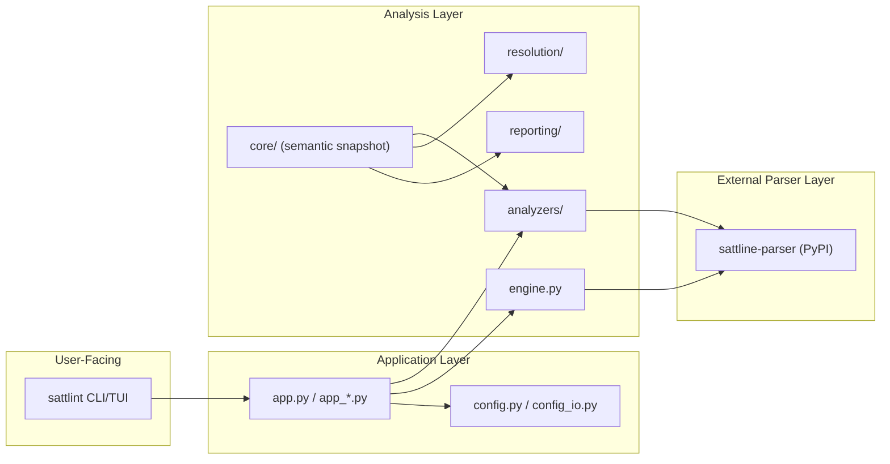

# Architecture Summary

This is the short architecture summary for onboarding and AI routing.
For deeper design rationale, use `docs/design-docs/`.

## Layering

### Layer responsibilities

- `src/sattlint/app.py` owns CLI flows, the interactive UI, analyzers, reporting, validation, and configuration.
- `src/sattlint/core/` owns the semantic snapshot helpers used by analysis.
- `src/sattlint/analyzers/` owns the heuristic analyzers and the registry.
- `sattline-parser` (external dependency, `sattline-parser>=2026.8.1`) owns the SattLine grammar, parse tree transformation, and AST models.

## Operational Layer

- `src/sattlint/` owns runtime product code. Repository maintenance tooling and generated health dashboards are not shipped.
- `.github/` owns CI workflows and scoped instruction files.

## Actual Runtime Entry Map

- `sattlint` enters at `src/sattlint/app.py`. Both command-mode flows (`syntax-check`, `analyze`, `validate-config`, `cache-prune`, `format-icf`) and the interactive Textual UI start there, then fan into app helpers, analyzers, reporting, and parser-backed semantic loading.
- The interactive UI (`sattlint` with no arguments) provides Analyze, Setup, Tools, and Help views.

## Critical Boundaries

- Parser core ships as the external `sattline-parser` package and does not depend on application layers.
- All retained analyzers use the same semantic engine and findings model.
- The analyzer registry is the single rule catalog; CLI, UI, and reporting read from it rather than duplicating rule lists.

## Quality Anchors

- Fast local gate: `python -m pre_commit run --all-files` (when configured) or `ruff check`, `pyright`, and focused `pytest`
- Full suite: `python -m pytest -q`
- CI: GitHub Actions workflow `ci.yml` runs ruff, pyright, and the full pytest suite plus wheel smokes on pull request and push to `main`.
